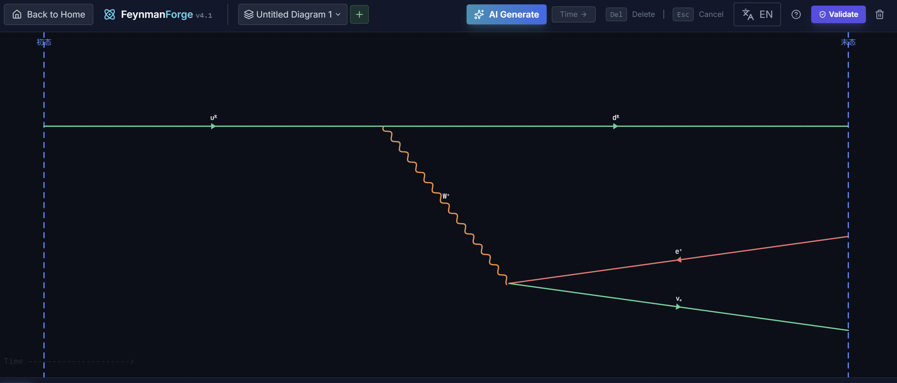
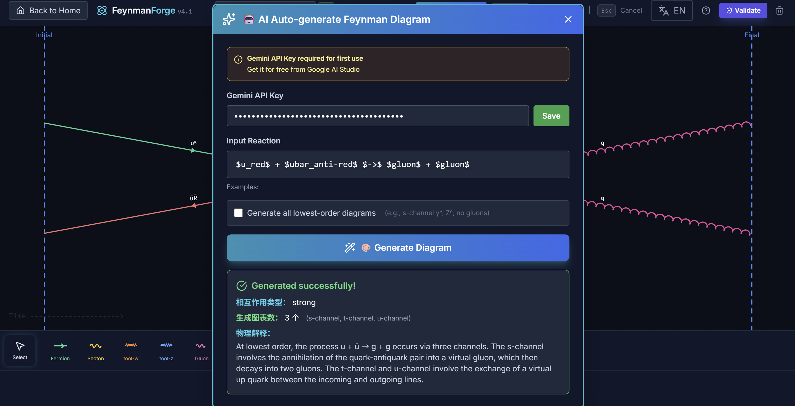
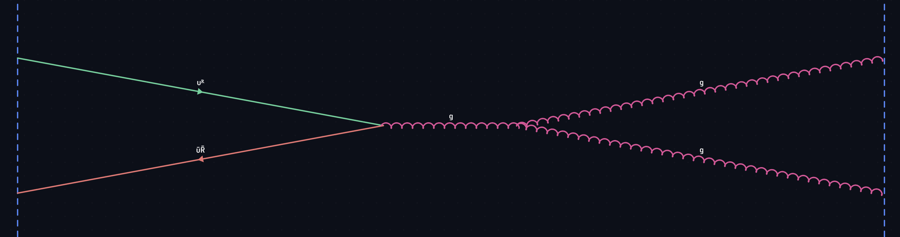
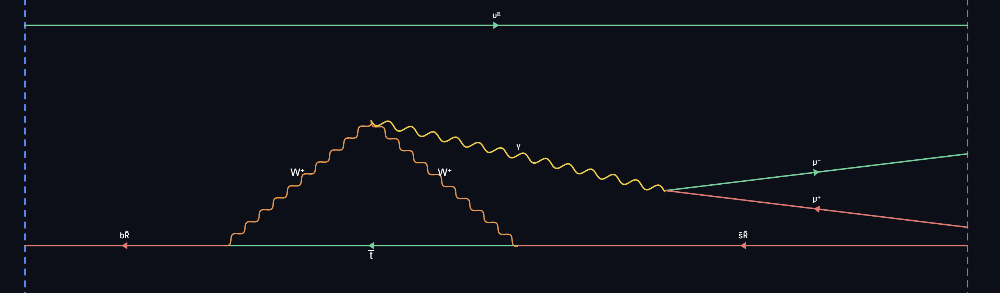

# Feynman Forge

Feynman Forge is a browser-based suite for particle physics visualization, featuring an interactive Feynman diagram editor, an AI-powered diagram generator, and a fundamental force simulator.

This project provides a set of tools designed for students and enthusiasts to draw, validate, and understand the interactions of the Standard Model.

## Core Features

* **Feynman Diagram Editor:** A full-featured, canvas-based editor for manually drawing diagrams.
* **Real-time Physics Validation:** Automatically validates diagrams at each vertex based on conservation laws (charge, lepton/baryon number, color charge).
* **AI-Powered Diagram Generation:** Uses Gemini to automatically generate all lowest-order diagrams from a simple text-based reaction.
* **Fundamental Force Visualization:** A separate, interactive module to visualize the Strong, Weak, Electromagnetic, and Gravitational forces, as well as the Higgs mechanism.
* **Multi-Canvas Management:** A complete system for creating, naming, duplicating, switching, and exporting/importing multiple diagram canvases.

## Inspiration and Credit

This project is inspired by the implementations, setups of **FeynCraft** (arXiv:2510.14082v1). I really enjoyed in this game of drawing Feynman diagrams to helps my exam.

The core idea of an interactive, browser-based tool that provides real-time feedback on vertex validity was a foundational concept that we adapted. While FeynCraft features its own internal logic for problem generation, our implementation explores a new approach by integrating a modern Large Language Model (Gemini) to achieve a similar goal: allowing users to specify a process and receive a valid, generated Feynman diagram.

## ✨ AI-Powered Diagram Generation

The standout feature of Feynman Forge is its ability to automatically generate diagrams using AI. You can provide a simple reaction, and the system will query the Gemini AI to generate all valid lowest-order diagrams and draw them on the canvas.

### How to Use the AI Feature

1. **Open the AI Panel:** In the `feymann.html` editor, click the **"AI Generate"** (`AI 生成`) button in the top header.
2. **Set Your API Key:** The first time you use this feature, you must provide a Gemini API Key.
   * Paste your key into the **"Gemini API Key"** field.
   * Click **"Save"** (`保存`). This is a one-time setup and is saved in your browser's local storage.
3. **Enter Your Reaction:** In the **"Input Reaction"** (`输入反应式`) field, type the process you want to generate. You must use the specific LaTeX-style format (see below).
4. **Choose Generation Mode:** You can check the **"Generate all lowest-order diagrams"** (`生成所有最低阶费曼图`) box to have the AI attempt to find all possible tree-level diagrams (e.g., both s-channel and t-channel). If multiple diagrams are generated, they will be placed in new, automatically-named canvases.
5. **Generate:** Click the **"Generate Diagram"** (`生成费曼图`) button. The system will show a loading state and then draw the resulting diagram(s) on the canvas.

## NOTE: THERE IS CURRENTLY NO AI CAN DRAW FEYNMAN DIAGRAM PERFECTLY.

**The current model that was been is Gemini-2.5-pro, according to my empirical test, it always have hard time for complicated reactions especially in Strong interaction (as the colour charge conservation is always been violated).**

### AI Input Format

The AI parser (`gemini-integration.js`) requires a specific format to understand your reaction.

**Structure:** `$particle1$ + $particle2$ $->$ $particle3$ + $particle4$`

* Each particle **must** be enclosed in `$` symbols.
* The initial and final states **must** be separated by `$->$`.
* Spaces between particles and `+` signs are recommended.

#### Supported Particle Symbols

Here is a list of common supported particle symbols, derived from the `PARTICLE_SYMBOLS` map in `gemini-integration.js`:

| Category                 | Particle           | Input Symbol                |
| :----------------------- | :----------------- | :-------------------------- |
| **Leptons**        | Electron           | `$e-$`                    |
|                          | Positron           | `$e+$`                    |
|                          | Muon               | `$mu-$`                   |
|                          | Anti-Muon          | `$mu+$`                   |
|                          | E-Neutrino         | `$nu_e$`                  |
|                          | Anti-E-Neutrino    | `$anti_nu_e$`             |
| **Quarks**         | Up                 | `$u$`                     |
|                          | Anti-Up            | `$ubar$`                  |
|                          | Down               | `$d$`                     |
|                          | Anti-Down          | `$dbar$`                  |
| **Quarks (Color)** | Up (Red)           | `$u_red$`                 |
|                          | Down (Green)       | `$d_green$`               |
|                          | Anti-Up (Anti-Red) | `$ubar_anti-red$`         |
| **Bosons**         | Photon             | `$photon$` or `$gamma$` |
|                          | Gluon              | `$gluon$` or `$g$`      |
|                          | W+ Boson           | `$W+$`                    |
|                          | W- Boson           | `$W-$`                    |
|                          | Z Boson            | `$Z$` or `$Z0$`         |
|                          | Higgs Boson        | `$H$` or `$higgs$`      |

#### Examples

Here are some valid inputs you can try:

* `$e-$ + $e+$ $->$ $mu-$ + $mu+$` (Electron-positron annihilation to muon pair)
* `$u_red$ + $ubar_anti-red$ $->$ $gluon$ + $gluon$` (Quark-antiquark annihilation to gluons)
* `$gamma$ + $e-$ $->$ $gamma$ + $e-$` (Compton scattering)

## Other Features

### Manual Drawing & Validation

(Powered by `feynman-logic.js`)

The core of the application is a manual editor where you can draw your own diagrams.

* **Particle Toolbar:** Select from Fermions, Photon, W/Z Bosons, Gluons, and Higgs.
* **Fermion Properties:** When drawing fermions, you can specify the family (Lepton, Up-type Quark, Down-type Quark), the specific particle, and its color charge (for quarks).
* **Smart Snapping:** Lines automatically snap to the endpoints of other lines to form vertices.
* **Real-time Validation:** Click the **"Validate"** (`验证守恒`) button to check your diagram. The system will check each vertex for:
  * Charge Conservation (Q)
  * Lepton Number (L)
  * Baryon Number (B)
  * Color Charge Conservation
  * Vertex Dimensionality (prevents non-physical vertices)
  * Interaction Rules (e.g., photons only couple to charge)

### Force Visualization

(Powered by `force_visualization_desktop.html` & `force-viz-logic.js`)

This is a separate educational module, accessible from `start.html`, that provides interactive animations for the fundamental forces:

* **Strong Force:** Visualizes quarks (u, u, d) bound within a proton by gluons.
* **Electromagnetic:** Shows attraction/repulsion mediated by photons.
* **Weak Force:** Animates beta decay (n → p + e⁻ + ν̄ₑ) mediated by a W⁻ boson.
* **Gravity:** Demonstrates the curvature of spacetime and gravitational waves.
* **Higgs Mechanism:** Shows how the Higgs field gives mass to particles.

### Canvas Management

(Powered by `canvas-manager.js` & `canvas-manager-ui.js`)

You can work on multiple diagrams at once using the canvas management system.

* **Create & Switch:** Click the canvas name (`Untitled`) to open the manager. From here you can create new canvases, switch between them, rename, or duplicate them.
* **Auto-Save:** All your diagrams are automatically saved to your browser's local storage.
* **Export/Import:** You can export all your canvases to a single JSON file as a backup, and re-import them later.

## How to Run

This is a static, frontend-only application. No server or build-step is required.

1. Ensure all the provided files (`.html`, `.js`) are in the same directory.
2. Open the `start.html` file in a modern web browser.
3. Choose one of the two modules to begin.

## Examples:

### beta+ decay (weak interaction for up quark)

### Up and anti-up quark annihilation (via strong interaction)

# How AI generate diagram works:
## Stage 1: Input parsing and prompt engineering
**Input:** The system will first extract user's input and find out initial and final state particles. The prompt is design to provide 3-fold answers. 
   1. Chain of thought: Ask model to think step by step how is the interaction, conservation laws works.
   2. Graph vector: Ask model to provide a graph vector representation of the Feynman diagram, forbidding any $(x,y)$ coordinate output. Forcing model to focus the topological structure of the physical interaction.
   3. Constraints check: Check if the output particles can maps to the existing particle chart making sure following program can read the output.

## Stage 2: Graph Vector model:
Gemini's output is a Directed Acyclic Graph (DAG) representation of the Feynman diagram. Each node represents a vertex, and edges represent particles. 

For every nodes in the graph, it contains the following properties:
    1. id
    2. type (initial, final, interaction)
  
For every edges in the graph, it contains the following properties:
    1. source
    2. target
    3. particle (id, spin, color, isAnti, isVirtual,...)

## Stage 3: Layout algorithm:
Use Sugiyama Framework to generate a layout for the given graph vectors. 
### Layering:
Find out the layers of the graph on $x$ axis (as we define from left to right is how time flows). Let the initial state particles on the Layer 0, final stage particles on the MaxLayer. If $u\to v$ then $Layer(v) \ge Layer(u) + 1$. 
### Crossing Reduction:
After finding out the layering on the $x$ axis, we need find out the ordering on the $y$ axis. Use Barycenter Heuristic to calculate optimal position relative to the previous layer. Continue the iteration till the local optimizer.
### Coordinate Assignment:
Map the layering and ordering to the actual $(x,y)$ coordinates on the canvas. For the Penguin Diagram, such as in the B meson decay, where weak interaction happened twice, system will recognize the loop structure and assign coordinates accordingly.
### Drawing:
Canvas will draw the particles according to their id, colour, isAnti, ... properties. For example, quarks are solid lines, gluons are curly lines, photons are wavy lines, etc. Finally, at the end stage system will call the validation engine to check the physics rules such as colour charge, lepton number, baryon number conservation at each vertex. If AI is generating wrong diagram, the system will capture and notify AI generate feature failed, then provide the error message to AI for next attempt. After such `for` loop of attempts (default 3 times), if still cannot get a valid diagram, the system will notify user to redraw manually.